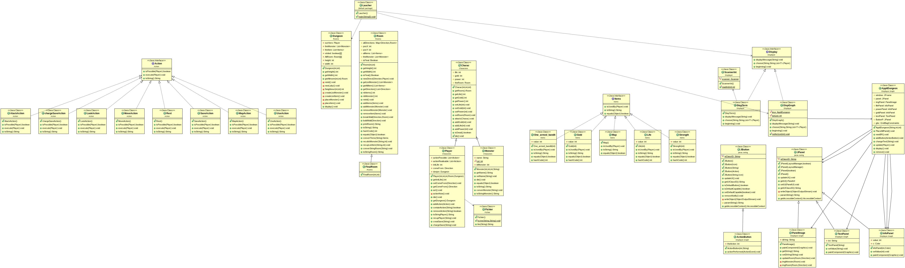

TP de ROUGETET Arnaud && LEFEVERE Rodolphe
==========================================

Intro
=====

le but de ce projet est de faire un jeu textuel sur un donjon, 
Le jeu permet interpréter un personnage avec une vie,une puissance d'attaque, et de l'or,
le personnage peut se déplacer dans les salles du donjon, attaquer les monstre et utilisé des items.
le but du jeu est d'arriver à la sortie du donjon, 

HOW TO
======
* récuparation du dépots 
	fait un git pull dans l'invite de commande
* génération de la javadoc
	mvn javadoc:javadoc
* commande de génération du projet 
	mvn packages
* commande d'exècution du projet 
	java -jar target/COO-TP1-1.0-SNAPSHOT.jar

	

PRÉSENTATION DU CODE
====================

* point de conception
	* notre programme ajoute au jeu une interface graphique permettant de voir les salles dans lequel on se déplace et les monstres qu'on peux affronter.
	* nous avons aussi un systéme de sauvegarde que le joueur peux utiliser lors de sa partie
évitant ainsi de se retrouver bloqué contre un monstre trop fort
	* notre donjon génére aléatoirement des labyrinthe avec une seul sortie 
	* nous avons ajouté une action permettant au joueur d'obtenir la carte du donjon dans lequel il se trouve 
	* Les images situé à la source ne sont pas des fichiers inutile. Ne pas les supprimé sous risques d'erreur lors de l'execution du .jar
	* Images du donjon généré par le binome sous le logiciel Blender

* présentation de design pattherns 
	* KISS  Les méthodes sont les plus décomposés et les plus simple possible
	* YAGNI Il n'y a pas de méthode isolé qui n'est pas utilisé quelque part dans les autres classes

* Le diagramme UML de notre projet généré avec Eclipse. Les flèches qui ne se terminent pas par des triangles fermés ne sont pas des relations d'héritages ou d'interface mais des relations :
 	* Association, trait plein et triangles non fermé, créer une instance de la classe pointé par la flèche
	* Dependencies , trait pointillé et triangles non fermé, manipule une instance de la classe pointé par la flèche

	* Pour des problèmes de visibilité seule 4 classes ont leurs deux relations décrit ci-dessus de généré, ce sont les classes AppliDonjon, Laucher, Fichier et ScannerInt.

 
